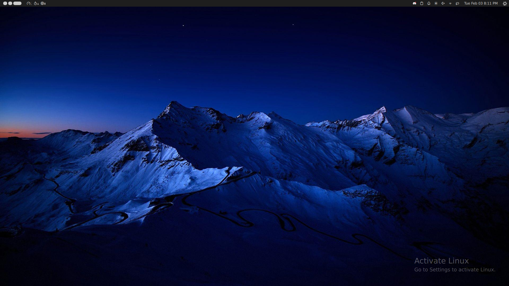

# Activate Linux

A simple, static message in the bottom right hand corner to remind you that your operating system isn't burdened by such restrictive terms as the likes of Windows.

Allows the user to fully customize the text shown in the watermark. Free as in freedom. 🦅

## Usage

- Install and activate the plugin
- Open the plugin settings to change any of the displayed text

## Requirements

- Noctalia Shell (any version)

## Changelog

### v1.1.0

- Retrieve OS name from HostService
- Expand options to allow complete text customization

### v1.0.0

- Initial implementation
- I18n for all languages mentioned in the plugin documentation
- Settings UI for configuring OS name

## License

MIT

## Authors

- outfoxxed (initial example [from quickshell documentation](https://git.outfoxxed.me/quickshell/quickshell-examples/src/branch/master/activate_linux))
- pgattic (port to noctalia-shell)

