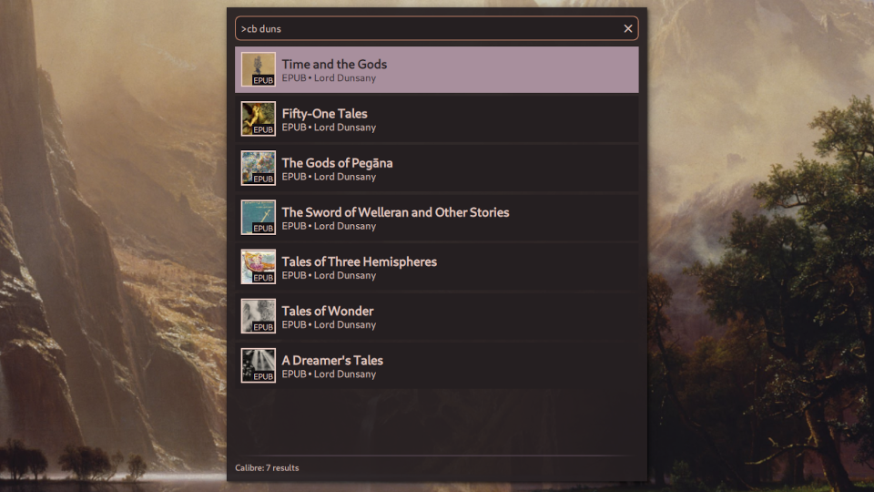

# Calibre Provider

A launcher provider plugin that lets you search your Calibre library by title or author.

## Usage

1. Open the Noctalia launcher
2. Type `>cb` to enter Calibre mode
3. Add a search term after the command (e.g., `>cb duns`)
4. Select your book and press Enter

Alternatively, you can trigger the provider by IPC with the command `qs -c noctalia-shell ipc call plugin:calibre-provider toggle`.

## Settings

### Launcher
If you don't have `xdg-open` installed, or prefer to use a different file opener, you can configure this using the Launcher setting.

### Force Grid mode
Enable this to force the launcher into grid view when searching Calibre. This gives the cover images more space, but shows less metadata. If this option is disabled, your configured launcher view will be used.

## Requirements

- Noctalia 4.3.0 or later
- Calibre
- xdg-open (Or other smart file opener. You can change this in the settings.)
